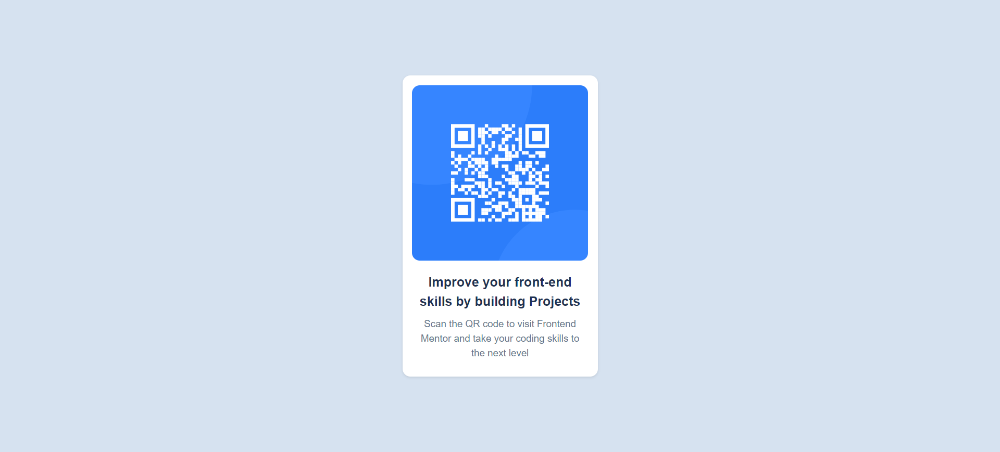

# Frontend Mentor - QR code component solution

This is a solution to the [QR code component challenge on Frontend Mentor](https://www.frontendmentor.io/challenges/qr-code-component-iux_sIO_H). Frontend Mentor challenges help you improve your coding skills by building realistic projects. 

## Table of contents

- [Frontend Mentor - QR code component solution](#frontend-mentor---qr-code-component-solution)
  - [Table of contents](#table-of-contents)
  - [Overview](#overview)
    - [Screenshot](#screenshot)
    - [Links](#links)
  - [My process](#my-process)
    - [Built with](#built-with)
    - [What I learned](#what-i-learned)
    - [Continued development](#continued-development)
  - [Author](#author)

## Overview

### Screenshot

### Links

- Solution URL: [Github Repo](https://github.com/rohanpawar680/frontend-mentor-qr-code-component)

## My process

### Built with

- Semantic HTML5 markup
- CSS custom properties
- Flexbox
- Mobile-first workflow

### What I learned

In this project, I improved my understanding of HTML structuring by creating a more organized and semantic markup. I also gained a better understanding of using CSS Flexbox to create a responsive and flexible layout. Specifically, I learned how to use Flexbox to center elements both horizontally and vertically, and how to create a mobile-first workflow to ensure a responsive design.

### Continued development

In future projects, I would like to continue to focus on improving my understanding of CSS Grid and how to use it in conjunction with Flexbox to create more complex and responsive layouts. I would also like to explore more advanced CSS techniques, such as creating custom animations.

## Author

- Frontend Mentor - [@rohanpawar680](https://www.frontendmentor.io/profile/yourusername)
